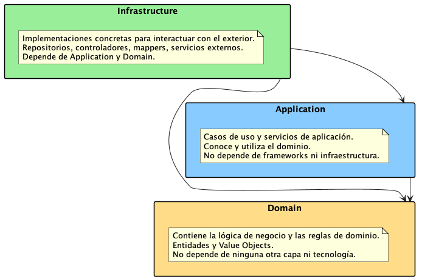
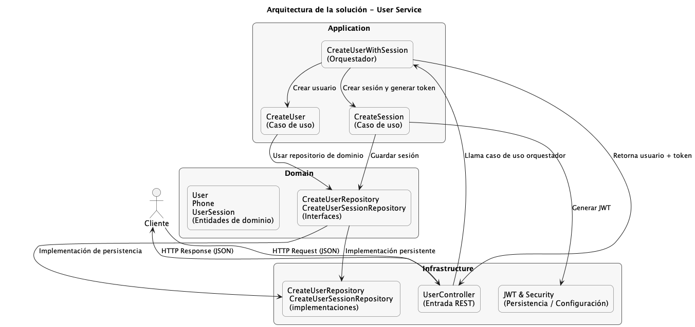
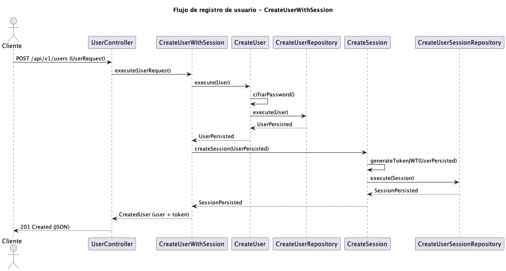

# API RESTful de Registro y Autenticación de Usuarios

API RESTful para el registro y autenticación de usuarios, desarrollada con **Spring Boot 3.5.7** y **Java 17**.  
Permite crear nuevos usuarios y generar automáticamente un **token JWT** para la autenticación.

---

## Cómo ejecutar

### Requisitos

- **Java 17+**
- **Gradle 8+**

---

### Clonar el repositorio

```bash
git clone https://github.com/leonardo1317/user-service.git
cd user-service
```

### Ejecutar la aplicación

```bash
./gradlew bootRun
```

La API se iniciará en:  
http://localhost:8080

---

## Variables de entorno

| Variable | Descripción |
|-----------|-------------|
| `JWT_SECRET` | Clave secreta en Base64 para firmar los tokens JWT (opcional, ya tiene un valor por defecto) |

Ejemplo en Linux/Mac:

```bash
export JWT_SECRET=BIXSbl2F8xuoUXx43MWNRAsgTcpkkKLTX4fMrKc2cXg=
```

---

## Endpoint principal

### `POST /api/v1/users`
Registra un nuevo usuario y genera un token JWT.

#### Ejemplo de request

```json
{
  "name": "Juan Rodriguez",
  "email": "juan3@rodriguez.com",
  "password": "hunter2A1",
  "phones": [
    {
      "number": "1234567",
      "cityCode": "1",
      "countryCode": "57"
    }
  ]
}
```

#### Ejemplo de response

```json
{
  "id": "0a8de973-fb5d-42e2-b36a-36e83f8c2ffc",
  "name": "Juan Rodriguez",
  "email": "juan3@rodriguez.com",
  "phones": [
    {
      "id": "f160992e-bd30-495b-900d-998f655df206",
      "number": "1234567",
      "cityCode": "1",
      "countryCode": "57"
    }
  ],
  "created": "2025-11-10T17:12:18.358517",
  "modified": "2025-11-10T17:12:18.442078",
  "lastLogin": "2025-11-10T17:12:18.358517",
  "token": "eyJhbGciOiJIUzI1NiJ9....",
  "isActive": true
}
```

---

## Base de datos

El proyecto usa **H2 en memoria**, creada automáticamente al iniciar la aplicación.

- **Consola:** [http://localhost:8080/h2-console](http://localhost:8080/h2-console)
- **JDBC URL:** `jdbc:h2:mem:testdb`
- **Usuario:** `sa`
- **Contraseña:** _(vacía)_
```sql
CREATE TABLE users (
id UUID PRIMARY KEY,
name VARCHAR(255) NOT NULL,
email VARCHAR(255) NOT NULL UNIQUE,
password VARCHAR(255) NOT NULL,
created_at TIMESTAMP NOT NULL,
modified_at TIMESTAMP,
last_login TIMESTAMP,
is_active BOOLEAN NOT NULL,
CONSTRAINT users_email_unique UNIQUE (email)
);

CREATE TABLE phones (
id UUID PRIMARY KEY,
number VARCHAR(50) NOT NULL,
city_code VARCHAR(10),
country_code VARCHAR(10),
user_id UUID NOT NULL,
CONSTRAINT fk_phones_user FOREIGN KEY (user_id)
REFERENCES users (id)
ON DELETE CASCADE
);

CREATE TABLE user_sessions (
id UUID PRIMARY KEY,
token VARCHAR(255) NOT NULL UNIQUE,
created_at TIMESTAMP NOT NULL,
expires_at TIMESTAMP,
user_id UUID NOT NULL,
CONSTRAINT fk_sessions_user FOREIGN KEY (user_id)
REFERENCES users (id)
ON DELETE CASCADE
);
```
---

## Documentación de la API

Swagger UI disponible en:  
 [http://localhost:8080/swagger-ui.html](http://localhost:8080/swagger-ui.html)

---

## Diagrama conceptual






---

## Licencia

Proyecto desarrollado con fines educativos.  
**Autor:** Leonardo Romero (leonardo1317)  
**Licencia:** Apache License 2.0
